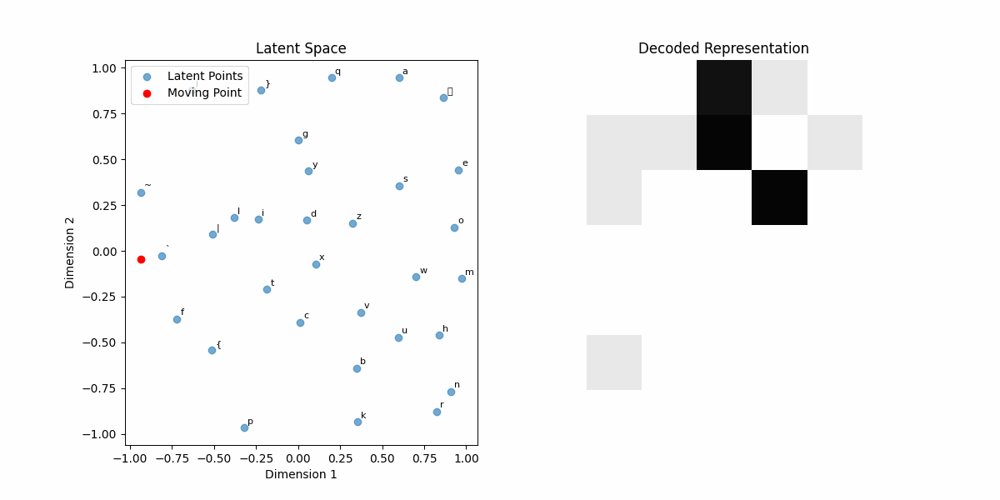

# SIA Portfolio: Search, Learning, Optimization, and Generation

This repository is a full AI/ML journey implemented across six projects, from classical search and evolutionary computation to supervised learning, unsupervised learning, and deep generative models.

The structure below intentionally uses topic names (instead of generic `tp0`, `tp1`, ..., `tpN`) so visitors can immediately see the real scope of the work.

## Topic-First Map

| Topic Name | Folder | What is inside |
| --- | --- | --- |
| Pokemon Capture Probability and Data Analysis | `tp0` | Data analysis workflow for modeling Pokemon capture function behavior |
| State-Space Search: 8-Puzzle + Sokoban | `tp1` | BFS, DFS, A*, Local Greedy, Global Greedy, heuristics, benchmarking |
| Genetic Algorithms for RPG Build Optimization | `tp2` | Evolutionary operators, adaptive mutation, selection/replacement strategies |
| Supervised Learning: Perceptrons and MLPs | `tp3` | Step/linear/non-linear perceptrons, MLPs, optimizer studies, noise robustness |
| Unsupervised Learning and Associative Memory | `tp4` | Kohonen SOM, PCA, Oja, Sanger, Hopfield |
| Autoencoders and Variational Latent Spaces | `tp5` | AE, DAE, VAE, latent-space exploration, custom image experiments |

## Why This Repo Is Interesting

- It covers both symbolic AI and statistical learning.
- It includes from-scratch implementations, not just high-level library wrappers.
- It focuses on experimentation: configuration-driven runs, metrics, plots, and visual analysis.
- It demonstrates breadth and depth across core AI foundations and modern ML methods.

## Concept Depth Covered

- Search and planning: backtracking, repeated-state handling, informed vs uninformed search.
- Evolutionary computation: crossover/mutation design, dynamic mutation schedules, mixed selection policies.
- Supervised learning: perceptrons, MLP topology tuning, optimizer effects, noisy data robustness.
- Unsupervised learning: topology-preserving maps, dimensionality reduction, Hebbian rules.
- Associative memory: Hopfield pattern storage and recovery dynamics.
- Generative modeling: AE/DAE/VAE and latent-space geometry.

## Project Narratives

### 1) Pokemon Capture Probability and Data Analysis (`tp0`)

This project introduces the portfolio with a data analysis workflow focused on Pokemon capture probability modeling. It establishes reproducible experimentation through config-based execution and report-driven interpretation.

- Folder README: [`tp0/README.md`](tp0/README.md)
- Docs: [`tp0/docs/SIA_TP0.pdf`](tp0/docs/SIA_TP0.pdf), [`tp0/docs/Informe-TP0.pdf`](tp0/docs/Informe-TP0.pdf)
- Run:

```bash
cd tp0
pipenv install
pipenv run python main.py ./configs
```

### 2) State-Space Search: 8-Puzzle + Sokoban (`tp1`)

This project explores classical AI search deeply, combining algorithmic implementations with visual and metric-based comparisons.

- Implemented search methods include BFS, DFS, A*, Local Greedy, and Global Greedy.
- Includes heuristic experimentation and analysis pipelines for runtime, expanded nodes, and movement cost.
- Provides both interactive Sokoban visualization and reproducible batch experiments.

Folder docs:
- [`tp1/README.md`](tp1/README.md)
- Core algorithms: [`tp1/core/algorithms`](tp1/core/algorithms)
- Heuristics: [`tp1/core/heuristics.py`](tp1/core/heuristics.py)

Representative visuals:


### 3) Genetic Algorithms for RPG Build Optimization (`tp2`)

This project builds an optimization engine to find high-performing RPG character configurations under game-time constraints.

- Rich operator design: multiple crossover types, mutation modes, and mutation distributions.
- Dynamic mutation rates (constant, sinusoidal, exponential decay).
- Weighted composition of parent selection and replacement strategies.
- Extensive config system for reproducibility and hyperparameter analysis.

Folder docs:
- [`tp2/README.md`](tp2/README.md)
- Main run entry: [`tp2/src/master.py`](tp2/src/master.py)

Representative visuals:


### 4) Supervised Learning: Perceptrons and MLPs (`tp3`)

This project progresses from simple perceptrons to deeper MLP architectures, including practical tooling for training analysis and robustness testing.

- Step, linear, and non-linear perceptrons.
- MLP training for XOR, parity, and MNIST-like digit tasks.
- Optimizer comparisons (gradient descent, momentum, Adam).
- Noise-injection experiments and confusion-matrix evolution.

Folder docs:
- [`tp3/README.md`](tp3/README.md)
- Model implementations: [`tp3/src/models`](tp3/src/models)

Representative visuals:


### 5) Unsupervised Learning and Associative Memory (`tp4`)

This project focuses on structure discovery and memory dynamics via classic unsupervised and recurrent neural approaches.

- Kohonen SOM for topology-preserving projection and clustering.
- PCA implementation via covariance analysis.
- Oja and Sanger rules for principal component extraction.
- Hopfield network for pattern storage and denoising-style recovery.

Folder docs:
- [`tp4/README.md`](tp4/README.md)
- Core implementations: [`tp4/src/core`](tp4/src/core)

Representative visuals:


### 6) Autoencoders and Variational Latent Spaces (`tp5`)

This project extends the neural stack into representation learning and generation with AE, DAE, and VAE.

- AE/DAE abstractions built over MLP foundations.
- VAE implementation with encoder/decoder pipelines and latent sampling.
- Latent-space trajectory visualizations for interpretability.
- Custom image workflow for face dataset experimentation.

Folder docs:
- [`tp5/README.md`](tp5/README.md)
- Core implementations: [`tp5/src/core`](tp5/src/core)

Representative visuals:





## Full Project READMEs

- [`tp0/README.md`](tp0/README.md)
- [`tp1/README.md`](tp1/README.md)
- [`tp2/README.md`](tp2/README.md)
- [`tp3/README.md`](tp3/README.md)
- [`tp4/README.md`](tp4/README.md)
- [`tp5/README.md`](tp5/README.md)

## Complete Visual Atlas (All Images and GIFs)

All visual assets found in the repository are embedded below so the full experimentation trail is visible in one place.

<details>
<summary><strong>Pokemon Capture Probability and Data Analysis</strong> (<code>tp0</code>, 0 assets)</summary>

No images were found in this folder.
</details>


<details>
<summary><strong>State-Space Search: 8-Puzzle + Sokoban</strong> (<code>tp1</code>, 43 assets)</summary>


</details>


<details>
<summary><strong>Genetic Algorithms for RPG Build Optimization</strong> (<code>tp2</code>, 19 assets)</summary>


</details>


<details>
<summary><strong>Supervised Learning: Perceptrons and MLPs</strong> (<code>tp3</code>, 38 assets)</summary>


</details>


<details>
<summary><strong>Unsupervised Learning and Associative Memory</strong> (<code>tp4</code>, 5 assets)</summary>


</details>


<details>
<summary><strong>Autoencoders and Variational Latent Spaces</strong> (<code>tp5</code>, 9 assets)</summary>


</details>

## Running the Projects

Most folders use independent configs and environments. A practical flow is:

```bash
# example pattern
cd tpX
pipenv install
# run script defined in that folder README
```

## Final Note

This repository is designed as an AI/ML learning and engineering portfolio: each project focuses on a different problem class, and together they show end-to-end understanding of core concepts across search, optimization, supervised learning, unsupervised learning, and generative modeling.
