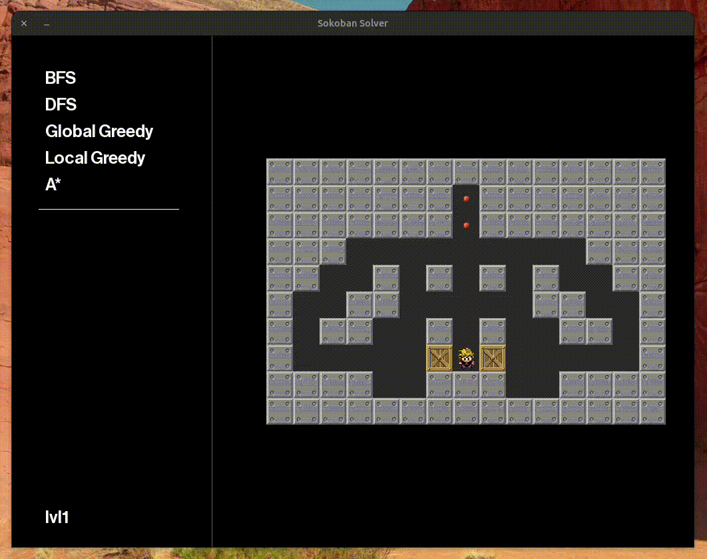

# Ejercicio I - 8-Puzzle

### ¿Que estructura de datos utilizarian?
Matriz de 3x3 donde cada valor es un char y el vacio es representado por el '\0'. Es decir, cada número del tablero lo representamos como char (1 es '1', 2 es '2', y así)
La igualdad de estados se realiza con un previo ordenamiento, ubicando en la esquina superior izquierda el valor minimo entre las 3 posibles esquinas.
Por ejemplo
3 2 1
4 0 6
7 8 5
Se reordena a la matriz a la forma canonica definida
1 6 5
2 0 8
3 4 7
De esta manera, podemos comparar rotaciones del tablero que pueden llegar a representar el mismo estado.

### Heuristicas Admisibles
- Sumatoria de distancias manhattan, aunque seria valido para norma = 0 (euclideana), norma supremo
- Sumatoria del triangulo superior sea menor
- Cantidad de posicionamientos correctos de los numeros, hacer una desviacion estandar segun la posicion de donde estas y donde deberia estar
- Cantidad de posicionamientos incorrectos de los numeros
- v siendo la lista de elementos
$$\sum_{i = 1}^{8} \frac{v[i]}{8\cdot i }-1$$

### ¿Que Algoritmo de Busqueda usarian y con que heuristicas?
Cuando hagamos el Sokoban vamos a tener mas idea


# Ejercicio II - Sokoban

Para instalar las dependencias usar pipenv

```sh
pipenv install
```

## Sokoban

Todos los códigos para el funcionamiento escencial de las estructuras y algorítmos se encuentran en la carpeta core.

El tp1 contiene el código necesario para poder probar distintos algorítmos de búsqueda (algunos desinformados como otros informados). En este repo se encuentran BFS, DFS, A*, Local Greedy y Global Greedy, ver: [directorio de algorítmos](core/algorithms/). Para los informados (que requieren de una heurística) se pueden usar las heurísticas definidas en el [archivo de heuristicas](core/heuristics.py). Dentro de la carpeta [models](core/models/) se encuentra la definición de estado y nodo.


La carpeta maps permite definir mapas como se definen en [este página](http://www.game-sokoban.com/index.php?mode=level&lid=200) que son parseados por el [map parser](core/utils/map_parser.py).

Hay varias formas de ejecución para el sokoban.

1. Modo interactivo [SOKBAN COOL](sokoban_cool.py)
2. Modo de generación de data [GENERATION](sokoban_data_generation.py)
3. Modo análsis [ANALYSIS](sokoban_data_analysis.py)

### Sokoban cool

Interfaz gráfica simple, hecha con pygame para probar distintos algorítmos y ver sus soluciones propuestas.



para ejecutarlo

```sh
python3 sokoban_cool.py path/to/map.txt
```

Dado que el objetivo de este tp no era tener una interfaz super perfecta (sino que obtener soluciones de mapas de sokoban) dejamos algunas configuraciones a hacer manualmente como por ejemplo elegir las heurísticas a usar para los algoritmos informados. Por default estan Manhattan1 y Deadlocks. Para cambiar esto se puede configurar en la función de `run_algorithm` de [sokoban_cool.py](sokoban_cool.py) donde se pueden quitar o introducir nuevas heurísticas definidas en el archivo de heurísticas. También es posible cambiar el texture pack agregando el parámetro en la función `load_images` mencionando el nombre de la carpeta que se quiera que está en [texture_packs](resources/texture_packs/).

### Sokoban data generation

Para usar data generation se debe definir un archivo de configuración con especificaciones de los métodos de corrida como el mapa, los algoritmos, las heurísticas y las iteraciones. También se define un archivo de salida en formato csv que es donde se vuelcan los resultados de las ejecuciones con información como el tiempo de ejecución, cantidad de nodos expandidos, solución, costo de la solución entre otros. En [configs](configs/) se encuentran varios de los usados para el análisis y la presentación.


Por ejemplo:
```json
{
    "executions": [
        {
            "output_file": "name_of_the_output_file.csv",
            "data_generation": {
                "maps": [ "map1.txt", "map2.txt"]
                "algorithms": [
                    {
                        "name": "ALGORITHM_1",
                        "heuristics": ["Heuristic_1", "Heuristic_2"]
                    },
                    {
                        "name": "ALGORITHM_2",
                        "heuristics": ["Heuristic_1"]
                    }
                ],
                "iterations_for_average": NUMBER_OF_ITERATIONS
            }
        }
    ]
}

```
donde todas las configuraciones deben ser de esta forma.

|campo | opciones|
|--|--|
| output_file| cualquier nombre seguido de .csv|
| maps | array de nombres de mapas a analizar (se buscan en maps/ asi que definirlos ahí)|
| algorithms | array de algoritmos |
| name | BFS, DFS, A_STAR, GREEDY_LOCAL, GREEDY_GLOBAL |
| heuristics | Manhattan1, Manhattan2, Manhattan3, Smarthattan, Deadlocks, DeadlockCorner, Basic, Euclidean|
| iterations_for_average | cantidad de ejecuciones de los algorítmos \*|

\* notar que esto sólo debería cambiar el tiempo de ejecución dado que es el único parámetro no determinístico para una ejecución


```sh
python3 sokoban_data_generation.py configs/my_configuration.json
```

El output csv de esta ejecución se guarda en la carpeta [output](output/) que está configurada para no commitearse.

### Sokoban data analysis

Esta ejecución nos permite hacer el análisis del paso previo (data generation) para generar gráficos comparativos de las distintas ejecuciones. Su propósito es ser configurado y perfeccionado a medida del que hace el análisis.

## Q&A sobre la implementación

### ¿Cómo implementamos backtracking?
Depende del algoritmo a usar pero sepuede ver en las implementaciones en el directorio de algoritmos que se usan setructuras tipo colas y stacks (algunos ordenados) como para mantener nodos con sus estados a la espera de ser popeados y explorados. De esta forma garantizando backtracking.


### ¿Qué hacemos con repetidos estados?

Nos aseguramos de no visitar nodos repetidos manteniendo un set paralelo a la ejecutción que garantiza evitar la repetición y evita entrar en loops infinitos.

- dfs importante como decidis el siguiente estado (no trivial) hay algunos tableros que dependen de esta decisión.
- checkeo de deadlocks
- a* debería dar óptimo para todas las heurisiticas admisibles


# Referencias

- [Experto en Heuristicas](https://www.reddit.com/r/algorithms/comments/fedzu1/pathfinding_heuristic_for_indirect_movement_like/)
- IDA*
- Poner cantidad de iteraciones en los graficos, y toda la informacion fija
- Usar otro color scheme para los graficos
- ponerte a un escalon de la solucion y que de mas la heuristica no admisible
- estado definido como posicion de las cajas y jugador
- Creas Mapa entonces tenes Walls, Targets
