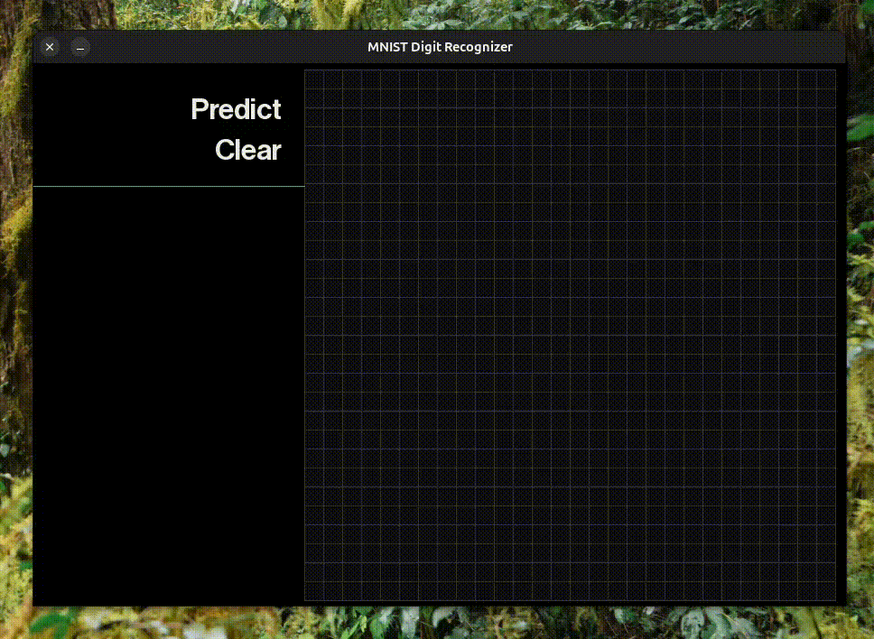

# Perceptrones y MLP

Este proyecto tiene implementaciones básicas de perceptrones lineales, no lineales y perceptrones multicapa (MLP). Las implementaciones se pueden encontrar en [el directorio de modelos](./src/models/).



En la carpeta [`./src`](./src) se encuentran varios archivos utilizados para analizar los perceptrones y graficar conclusiones o pruebas. Estos archivos se explican más [adelante](#archivos).

## Índice

- [Cómo usarlos](#cómo-usarlos)
  - [Perceptrones escalón, lineales y no lineales](#perceptrones-escalón-lineales-y-no-lineales)
    - [Perceptrón escalón](#perceptrón-escalón)
      - [Configuración](#configuración)
      - [Instanciación y entrenamiento](#instanciación-y-entrenamiento)
      - [Predicción](#predicción)
    - [Perceptrón lineal y no lineal](#perceptrón-lineal-y-no-lineal)
      - [Configuración](#configuración-1)
      - [Instanciación y entrenamiento](#instanciación-y-entrenamiento-1)
      - [Predicción](#predicción-1)
  - [Perceptrón multicapa](#perceptrón-multicapa)
    - [Configuración](#configuración-2)
    - [Instanciación y entrenamiento](#instanciación-y-entrenamiento-2)
    - [Predicción](#predicción-2)
- [Archivos](#archivos)
  - [Ejercicio 1](#ejercicio-1)
  - [Ejercicio 2](#ejercicio-2)
  - [Ejercicio 3](#ejercicio-3)
  - [Ejercicio 4](#ejercicio-4)

## Cómo usarlos

Esta sección tiene como objetivo explicar cómo se pueden usar nuestras implementaciones de perceptrones para poder instanciarlos, entrenarlos y luego realizar predicciones.

Primero, es importante mencionar que para que los perceptrones funcionen, los datos de entrada deben estar bien confeccionados, ya que se espera el formato correcto para que NumPy pueda armar vectores de n-dimensiones. Esto queda del lado del usuario. Recomendamos colocar los datos en la carpeta [./res](./res/), donde ya hay algunos ejemplos disponibles. No profundizamos en cómo hacer la confección necesaria, porque depende del formato de los datos, y puede variar considerablemente entre diferentes fuentes.

### Perceptrones escalón, lineales y no lineales

Por un lado, se encuentran los perceptrones simples (lineales y no lineales) en la carpeta [perceptrons](./src/models/perceptrons), que se usaron para los ejercicios 1 y 2. Para instanciar un modelo, se debe configurar un archivo `.json` de la siguiente forma:

#### Perceptrón escalón

##### Configuración

Por ejemplo, para el ejercicio 1 se usó el perceptrón escalón:

```json
{
    "epochs": 100,
    "learning_rate": 0.001,
    "epsilon": 1e-5,
    "seed": 42,
    "function": "AND"
}
```

| Parámetro       | Descripción                                                                                                                                                                                   | Tipo de valor                                        |
| --------------- | --------------------------------------------------------------------------------------------------------------------------------------------------------------------------------------------- | ---------------------------------------------------- |
| `epochs`        | Número de épocas o iteraciones sobre el conjunto de datos durante el entrenamiento del modelo. Más épocas implican más oportunidades de aprendizaje.                                          | `>0`                                                 |
| `learning_rate` | Tasa de aprendizaje utilizada en el optimizador para ajustar los pesos del modelo. Controla la magnitud de los cambios realizados en cada actualización.                                      | `>0` idealmente `<1` pero no hay restricción lógica. |
| `epsilon`       | Pequeño valor utilizado para la condición de corte cuando el error ya es despreciable.                                                                                                           | `número pequeño`                                     |
| `seed`          | Semilla utilizada para inicializar los generadores de números aleatorios. Garantiza que los resultados sean reproducibles si se vuelve a entrenar el modelo. Se puede evitar sin problema.    | `número`                                             |

> [!note]
> El parámetro "function" es solo auxiliar y no es necesario en otras situaciones. Muchas veces tuvimos distintas funciones para modelar y nos servía tener un parámetro que indicara cuál era la función del problema. Esta misma lógica se usa en otros lados y es un caso particular que se puede omitir sin afectar el funcionamiento.

##### Instanciación y entrenamiento

Se instancia de la siguiente forma:

```python
step_perceptron = PerceptronSimple(
    seed=config_file.get('seed', None),
    num_features=X.shape[1], # tamaño del input en cuanto a features dado por el set de datos
    learning_rate=config_file.get('learning_rate', 0.01),
    epsilon=config_file.get('epsilon', 1e-5),
)
```

y para entrenar el modelo instanciado:

```python
perceptron.train(X, y, config_file.get('epochs', 50))
```

##### Predicción

Finalmente, una vez entrenado, se puede usar el método

```python
prediction = perceptron.predict(X)
```

---
#### Perceptrón lineal y no lineal

##### Configuración

Para los perceptrones lineales y no lineales, el archivo es el mismo, excepto cuando se quiere usar un perceptrón no lineal, donde se debe agregar la función de activación que se usará.

```json
{
    "epochs": 1000,
    "learning_rate": 0.01,
    "epsilon": 1e-5,
    "seed": 42,
    "non_linear_fn": "sigmoid",
    "beta": 2.0
}
```

Similar al perceptrón escalón, pero con dos parámetros adicionales:

| Parámetro       | Descripción                                                                                                                                                              | Valores posibles          |
| --------------- | ------------------------------------------------------------------------------------------------------------------------------------------------------------------------ | ------------------------- |
| `non_linear_fn` | Función de activación no lineal utilizada en el modelo. Define cómo se transforma la entrada antes de pasar a la siguiente capa. Ejemplos incluyen sigmoid, tanh o ReLU. | `sigmoid`, `tanh`, `relu` |
| `beta`          | Parámetro adicional para funciones de activación no lineales como sigmoid o tanh, que puede controlar la forma o la pendiente de la función.                             | `número`                  |

##### Instanciación y entrenamiento

Su forma de instanciación es similar al perceptrón base:

```python
linear_perceptron = PerceptronLinear(
    seed,
    num_features,
    learning_rate,
    epsilon,
)

non_linear_perceptron = PerceptronNonLinear(
    seed,
    num_features,
    learning_rate,
    epsilon,
    non_linear_fn,
    beta
)
```

y para entrenar el modelo es idéntico al [entrenamiento del perceptrón lineal](#instanciación-y-entrenamiento-1).

##### Predicción

Finalmente, una vez entrenado, se puede usar el método

```python
prediction = perceptron.predict(X)
```

---

### Perceptrón multicapa

#### Configuración

Para usar el MLP, el archivo de configuración es más grande pero similar:

```json
{
    "problem": {
        "type": "mnist_digits",
        "data": "../res/mnist.pkl.gz",
        "output": "./output/ej4/digits.csv"
    },
    "network": {
        "topology": [
            784,
            30,
            10
        ],
        "activation_function": {
            "method": "sigmoid",
            "beta": 1
        },
        "optimizer": {
            "method": "gradient_descent"
        }
    },
    "training": {
        "seed": 42,
        "epochs": 20,
        "mini_batch_size": 16,
        "learning_rate": 0.5,
        "epsilon": 0.01
    }
}
```

Al igual que la configuración del perceptrón escalón, tiene parámetros que son accesorios para problemas particulares y pueden ser ignorados.

| Sección    | Parámetro                    | Descripción                                                                                                                                                                                                | Valor Ejemplo               |
| ---------- | ---------------------------- | ---------------------------------------------------------------------------------------------------------------------------------------------------------------------------------------------------------- | --------------------------- |
| `problem`  | `type`                       | Accesorio: Tipo de problema a resolver, en este caso es la clasificación de dígitos usando MNIST.                                                                                                          | `"mnist_digits"`            |
|            | `data`                       | Accesorio: Ruta al archivo de datos comprimido que contiene el conjunto de datos MNIST.                                                                                                                    | `"../res/mnist.pkl.gz"`     |
|            | `output`                     | Accesorio: Ruta donde se guardará el archivo con los resultados de las predicciones.                                                                                                                       | `"./output/ej4/digits.csv"` |
| `network`  | `topology`                   | Estructura de la red neuronal, define el número de neuronas en cada capa (entrada, oculta, salida). Se pueden definir varias capas ocultas.                                                                | `[784, 30, 10]`             |
|            | `activation_function.method` | Función de activación utilizada en las neuronas. Ejemplos: `sigmoid`, `tanh`.                                                                                                                              | `"sigmoid"`                 |
|            | `activation_function.beta`   | Parámetro adicional para ajustar la forma de la función de activación (aplicable para algunas funciones como `sigmoid` o `tanh`).                                                                       | `1`                         |
|            | `optimizer.method`           | Método de optimización para ajustar los pesos de la red. Puede ser `gradient_descent`, `adam`, o `momentum` ver [parámetros adicionales](#parámetros-adicionales-para-optimizadores).                                         | `"gradient_descent"`        |
| `training` | `seed`                       | Semilla para generar números aleatorios, garantiza reproducibilidad.                                                                                                                                       | `42`                        |
|            | `epochs`                     | Número de épocas (iteraciones completas sobre el conjunto de entrenamiento) que se ejecutarán.                                                                                                             | `20`                        |
|            | `mini_batch_size`            | Tamaño de los mini-batches utilizados durante el entrenamiento.                                                                                                                                            | `16`                        |
|            | `learning_rate`              | Tasa de aprendizaje utilizada para el optimizador, controla la magnitud de los ajustes en cada actualización de los pesos.                                                                                 | `0.01`                      |
|            | `epsilon`                    | Valor pequeño para determinar la convergencia.                                                                                                                                                                     | `0.01`                      |

##### Parámetros adicionales para optimizadores

- **Adam:**
    - `method`: `"adam"`
    - **Parámetros específicos:**
        - `beta_1`: Tasa de decaimiento exponencial para la media de los gradientes (tip: `0.9`).
        - `beta_2`: Tasa de decaimiento exponencial para la media de los cuadrados de los gradientes (tip: `0.999`).
        - `epsilon`: Valor pequeño para evitar divisiones por cero (tip: `1e-8`).
- **Momentum:**
    - `method`: `"momentum"`
    - **Parámetros específicos:**
        - `alpha`: Controla el factor de inercia de los gradientes anteriores (tip: `0.9`).

#### Instanciación y entrenamiento

Usando la utilidad de la clase Config en [utils](./src/utils/). Es necesario usar Config para poder pasar la función de activación y de optimización correctamente. En caso de no querer usarla, se deberán crear instancias de `ActivationFunction` y `Optimizer` para pasarlas como parámetros a la instancia de la red neuronal.

```python
config = Config().read_config("./ruta/al/archivo.json")

net = MultilayerPerceptron(
    seed=config.seed,
    topology=config.topology,
    activation_function=config.activation_function,
    optimizer=config.optimizer,
)

net.fit(
    training_data=X,
    epochs=config.epochs,
    mini_batch_size=config.mini_batch_size,
)
```

#### Predicción

Similar a los otros perceptrones, se predice de la siguiente manera:

```python
net.feedforward(X)
```

---

# Archivos

## Ejercicio 1

### `ej1.py`
Este script implementa un perceptrón simple para resolver problemas de lógica como AND y XOR. Utiliza visualizaciones 2D para mostrar la evolución del límite de decisión a lo largo del entrenamiento, y genera un GIF animado que muestra las diferentes etapas de aprendizaje del modelo a través de las épocas.

## Ejercicio 2

### `ej2_analysis.ipynb`
Análisis de resultados y visualizaciones relacionados con perceptrones lineales y no lineales, evaluando métricas de rendimiento y explorando diferencias entre los métodos.

### `ej2_cv_robust.ipynb`
Implementación y análisis de validación cruzada para evaluar la robustez de modelos de perceptrón en términos de su capacidad de generalización y precisión.

### `ej2_loss_comparison.py`
Este script compara la evolución de la pérdida entre perceptrones lineales y no lineales a lo largo de varias épocas, mostrando los resultados mediante gráficos para activaciones como Sigmoid, Tanh y ReLU.

### `ej2_n_vs_l.py`
Este script realiza una comparación entre perceptrones lineales y no lineales utilizando métricas de regresión como MSE, MAE, R2 y RMSE. Emplea validación cruzada para evaluar el rendimiento de cada modelo, mostrando los resultados a través de gráficos.

## Ejercicio 3

### `ej3.py`
Este script entrena un MLP (Multilayer Perceptron) para varias tareas lógicas, como XOR, paridad y reconocimiento de números. Incluye diferentes configuraciones de entrenamiento que involucran datos limpios y ruidosos, aplicando validación cruzada y evaluando la precisión del modelo en distintos conjuntos de pruebas.

### `ej3_gen_noisy_nums.py`
Este script genera números con ruido aplicando técnicas como ruido Gaussiano y Salt and Pepper. Luego realiza una operación XOR entre los números originales y los ruidosos, y guarda los resultados en archivos específicos para pruebas y análisis posteriores.

### `ej3_graphics.py`
Script que genera gráficos para evaluar la precisión de modelos entrenados en términos de la evolución de la precisión a lo largo de las épocas. Incluye funciones para graficar la precisión de salida única y múltiple, así como comparaciones entre varias configuraciones de modelos.

### `ej3z5_optimizers.ipynb`
Notebook para el análisis y comparación de optimizadores en el entrenamiento de modelos, explorando sus efectos en el rendimiento y la convergencia del aprendizaje. En realidad, se usó el dataset MNIST para esta comparación.

## Ejercicio 4

### `ej4.py`
Script que carga el conjunto de datos MNIST y entrena un MLP para clasificar los dígitos escritos a mano. Realiza la normalización y preparación de datos, y evalúa la precisión del modelo sobre el conjunto de pruebas.

### `ej4_interface.py`
Este script implementa una interfaz gráfica con Pygame para dibujar dígitos y predecirlos usando un modelo entrenado de MLP (Multilayer Perceptron). Permite al usuario dibujar un dígito y recibir una predicción en tiempo real sobre el dígito dibujado, mostrando también la distribución de probabilidades para cada posible dígito.
