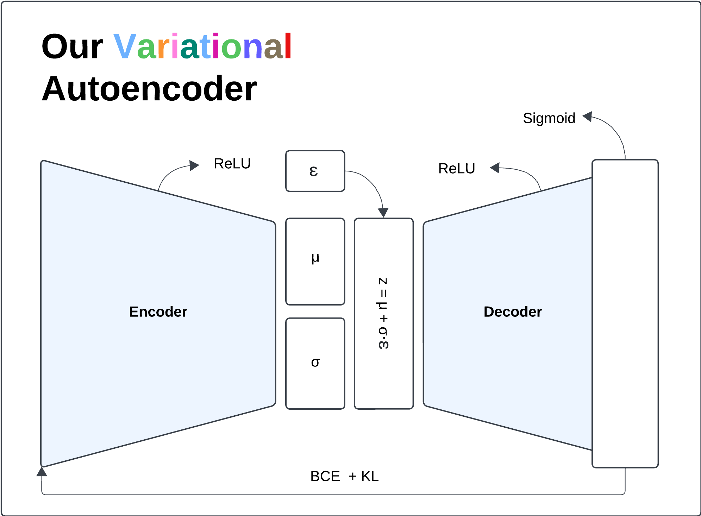

# Autoencoders (AE), Denoising Autoencoders (DAE) y Variational Autoencoders (VAE)


Este proyecto implementa y analiza principalmente tres tipos de redes autoencoders: Autoencoders (AE), Denoising Autoencoders (DAE) y Variational Autoencoders (VAE). Cuenta con herramientas para explorar cómo estas redes representan datos en espacios latentes y cómo se comportan bajo diferentes configuraciones y experimentos.


## Estructura del proyecto

El proyecto toma como inspiración la implementación de las redes neuronales previemente hechas. El AE y DAE no son más que una abstracción de un MLP. Volvimos a crear los archivos y no los referenciamos de la otra carpeta porque hubo cambios sutiles pero escencialmente son lo mismo que el tp3. Además e agrega la implementación VAE y una versión de logs para debugging.



> [!Note]
> Cabe destacar que en la representación que se muestra a continuación no se muestra el directorio /data ya que se optó por tomarlo como una característica client side. Nosotros proveemos algunos datasets y archivos de juguete pero idealmente si se quiere usar algo más complejo, recomendamos incluir el dataset por su cuenta en la carpeta /data y luego hacer uso de esta en los archivos de análisis.

```bash
├── docs
│   └── SIATP5.pdf                   # Informe del proyecto
├── README.md                        # Archivo de documentación
└── src
    ├── autoencoder.ipynb            # Análisis y experimentos con AE
    ├── vae.ipynb                    # Experimentos básicos con VAE
    ├── vae_custom.ipynb             # Experimentos avanzados con VAE
    ├── vae_emoji.ipynb              # Experimentos con emojis en VAE
    ├── latent_space_slow_smooth_path.gif    # Visualización del espacio latente (GIF)
    ├── latent_space_smooth_large_sine.gif   # Visualización de trayectorias suaves
    ├── latent_space_with_labels.gif         # Visualización del espacio latente etiquetado
    ├── core
    │   ├── activation_function.py   # Funciones de activación
    │   ├── initialization.py        # Inicialización de pesos y sesgos
    │   ├── multilayer_perceptron.py # Implementación base para AE/DAE
    │   ├── optimizer.py             # Métodos de optimización
    │   ├── vae.py                   # Implementación del VAE
    │   └── vae_logs.py              # Herramientas para análisis de logs

```

El archivo VAE custom provee un notebook que está configurado para hacer un entrenamiento default de un VAE para generación y experimentación con caras; se puede muy facilmente agregar una carpeta a `/data` por ejemplo `/data/mis_imagenes` y el notebook creará una nueva carpeta que recorte las imagenes, detecte caras y las deje preparadas para ser usadas en el VAE. Hacemos esta mención para el futuro donde querramos vovler a correr esto y sepamos por donde arrancar.


## Uso

### Ejemplo de entrenamiento con VAE

El siguiente código muestra cómo configurar y entrenar un modelo de VAE para vectores de 28*28 dimensiones como por ejemplo MNIST:

```python

import numpy as np
import matplotlib.pyplot as plt

from core.activation_function import ActivationFunction
from core.optimizer import Optimizer
from core.vae import VAE

# Configuración del modelo
latent_dim = 8  # Tamaño del espacio latente
encoder_topology = [28*28, 256, 128, 2 * latent_dim]
decoder_topology = [latent_dim, 128, 256, 28*28]

# Optimización y activación
encoder_optimizer = Optimizer(method="adam", eta=0.001)
decoder_optimizer = Optimizer(method="adam", eta=0.001)
activation_function = ActivationFunction(method="relu")

# Creación del modelo VAE
vae = VAE(
    seed=42,
    encoder_topology=encoder_topology,
    decoder_topology=decoder_topology,
    activation_function=activation_function,
    encoder_optimizer=encoder_optimizer,
    decoder_optimizer=decoder_optimizer
)

# Entrenamiento
vae.fit(training_data=training_data, epochs=20, mini_batch_size=16)

# Visualización de resultados
test_sample, _ = test_data[0]
recon_x, _, _, _, _, _, _, _, _ = vae.feedforward(test_sample)

plt.figure(figsize=(4, 2))
plt.subplot(1, 2, 1)
plt.imshow(test_sample.reshape(28, 28), cmap="gray")
plt.title("Original")
plt.axis("off")

plt.subplot(1, 2, 2)
plt.imshow(recon_x.reshape(28, 28), cmap="gray")
plt.title("Reconstruido")
plt.axis("off")
plt.show()

```

## Visualizaciones

El proyecto incluye GIFs que muestran la evolución de trayectorias en el espacio latente para diferentes configuraciones de autoencoders. Estos se encuentran en la carpeta `/src`.

